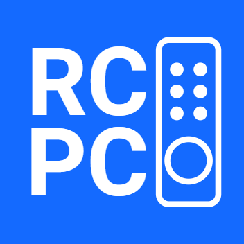

<!--
*** Thanks for checking out the Best-README-Template. If you have a suggestion
*** that would make this better, please fork the repo and create a pull request
*** or simply open an issue with the tag "enhancement".
*** Don't forget to give the project a star!
*** Thanks again! Now go create something AMAZING! :D
-->

<!-- PROJECT SHIELDS -->
<!--
*** I'm using markdown "reference style" links for readability.
*** Reference links are enclosed in brackets [ ] instead of parentheses ( ).
*** See the bottom of this document for the declaration of the reference variables
*** for contributors-url, forks-url, etc. This is an optional, concise syntax you may use.
*** https://www.markdownguide.org/basic-syntax/#reference-style-links
-->
[![Contributors][contributors-shield]][contributors-url]
[![Forks][forks-shield]][forks-url]
[![Stargazers][stars-shield]][stars-url]
[![Issues][issues-shield]][issues-url]
[![GPL v3.0 License][license-shield]][license-url]
[![LinkedIn][linkedin-shield]][linkedin-url]

<!-- PROJECT LOGO -->
 

  

<h3 align="center">RCPC</h3>

  

    RCPC aims to provide a easy to use tv style remote for your pc. Using your phone, connect to a server on your pc and control it using the touchpad and mediakey views.
     
     
    <a href="https://github.com/konradrej/RCPC/issues">Report Bug</a>
    ·
    <a href="https://github.com/konradrej/RCPC/issues">Request Feature</a>
  

<!-- TABLE OF CONTENTS -->

  
Table of Contents

  <ol>
    <li>
      <a href="#about-the-project">About The Project</a>
      <ul>
        <li><a href="#built-with">Built With</a></li>
      </ul>
    </li>
    <li><a href="#usage">Usage</a></li>
    <li><a href="#getting-started">Getting Started</a></li>
    <li>
      <a href="#projects">Projects</a>
      <ul>
        <li><a href="#servers">Servers</a></li>
        <li><a href="#clients">Clients</a></li>
        <li><a href="#misc">Misc</a></li>
      </ul>
    </li>
    <li><a href="#roadmap">Roadmap</a></li>
    <li><a href="#contributing">Contributing</a></li>
    <li><a href="#license">License</a></li>
    <li><a href="#contact">Contact</a></li>
    <li><a href="#acknowledgments">Acknowledgments</a></li>
  </ol>

<!-- ABOUT THE PROJECT -->
## About The Project

Please see the description at the start of the page or one of the specific <a href="projects">projects</a> for a more detailed about section.

(<a href="#top">back to top</a>)

### Built With

#### Windows Server
* [JmDNS](https://github.com/jmdns/jmdns)
* [Java Native Access](https://github.com/java-native-access/jna)
* [Hibernate](https://hibernate.org/)
* [H2 Database](https://www.h2database.com/html/main.html)
* [Log4j (2.17.0)](https://logging.apache.org/log4j/2.x/index.html)
* [SLF4J](https://www.slf4j.org/)

#### Android Client
* [Material.io](https://material.io/)
* [Android Jetpack](https://developer.android.com/jetpack)

#### Core
* [JmDNS](https://github.com/jmdns/jmdns)
* [Log4j (2.17.0)](https://logging.apache.org/log4j/2.x/index.html)

(<a href="#top">back to top</a>)

<!-- USAGE EXAMPLES -->
## Usage

1. Install one of the <a href="#servers">servers</a> on the PC you want to control.
2. Install one of the <a href="#clients">clients</a> on the device you want to control from.
3. Start the server.
4. Connect to the PCs IP address from the client either by manually entering the IP address or using the nearby servers feature.

(<a href="#top">back to top</a>)

<!-- GETTING STARTED -->
## Getting Started

For getting started instructions please go to one of the <a href="#projects">projects.</a>

(<a href="#top">back to top</a>)

<!-- SUBPROJECTS --> 
## Projects

### Servers
* [Windows Server](https://github.com/konradrej/RCPC-Server-Windows)

### Clients
* [Android Client](https://github.com/konradrej/RCPC-Client-Android)

### Misc
* [Core](https://github.com/konradrej/RCPC-Core)
* [Windows Native Library](https://github.com/konradrej/RCPC-Native-Library)

(<a href="#top">back to top</a>)

<!-- ROADMAP -->
## Roadmap

- [] Rewrite server and client to not rely on RCPC Core 
- [] Keyboard View
- [] Support for more operating systems

See the [open issues](https://github.com/konradrej/RCPC/issues) for a full list of proposed features (and known issues).

(<a href="#top">back to top</a>)

<!-- CONTRIBUTING -->
## Contributing

Contributions are what make the open source community such an amazing place to learn, inspire, and create. Any contributions you make are **greatly appreciated**.

If you have a suggestion that would make this better, please fork the repo and create a pull request. You can also simply open an issue with the tag "enhancement".
Don't forget to give the project a star! Thanks again!

1. Fork the Project
2. Create your Feature Branch (`git checkout -b feature/AmazingFeature`)
3. Commit your Changes (`git commit -m 'Add some AmazingFeature'`)
4. Push to the Branch (`git push origin feature/AmazingFeature`)
5. Open a Pull Request

(<a href="#top">back to top</a>)

<!-- LICENSE -->
## License

Distributed under the GNU GPL v3.0 License. See `LICENSE` for more information.

(<a href="#top">back to top</a>)

<!-- CONTACT -->
## Contact

Konrad Rej - rej.konrad@gmail.com

Project Link: [https://github.com/konradrej/RCPC](https://github.com/konradrej/RCPC)

(<a href="#top">back to top</a>)

<!-- ACKNOWLEDGMENTS -->
## Acknowledgments

* [Best README template](https://github.com/othneildrew/Best-README-Template)

(<a href="#top">back to top</a>)

<!-- MARKDOWN LINKS & IMAGES -->
<!-- https://www.markdownguide.org/basic-syntax/#reference-style-links -->
[contributors-shield]: https://img.shields.io/github/contributors/konradrej/RCPC.svg?style=for-the-badge
[contributors-url]: https://github.com/konradrej/RCPC/graphs/contributors
[forks-shield]: https://img.shields.io/github/forks/konradrej/RCPC.svg?style=for-the-badge
[forks-url]: https://github.com/konradrej/RCPC/network/members
[stars-shield]: https://img.shields.io/github/stars/konradrej/RCPC.svg?style=for-the-badge
[stars-url]: https://github.com/konradrej/RCPC/stargazers
[issues-shield]: https://img.shields.io/github/issues/konradrej/RCPC.svg?style=for-the-badge
[issues-url]: https://github.com/konradrej/RCPC/issues
[license-shield]: https://img.shields.io/github/license/konradrej/RCPC.svg?style=for-the-badge
[license-url]: https://github.com/konradrej/RCPC/blob/master/LICENSE.txt
[linkedin-shield]: https://img.shields.io/badge/-LinkedIn-black.svg?style=for-the-badge&logo=linkedin&colorB=555
[linkedin-url]: https://linkedin.com/in/konrad-rej